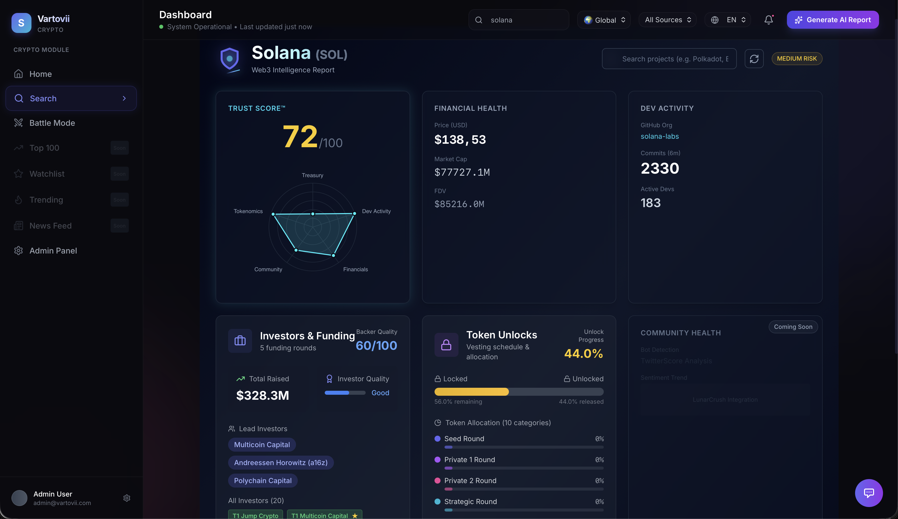
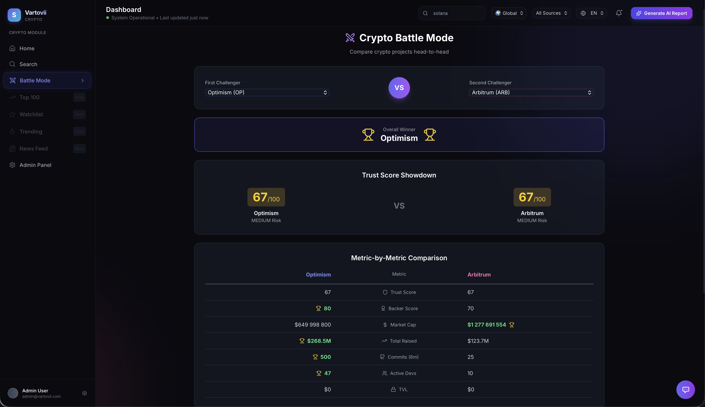
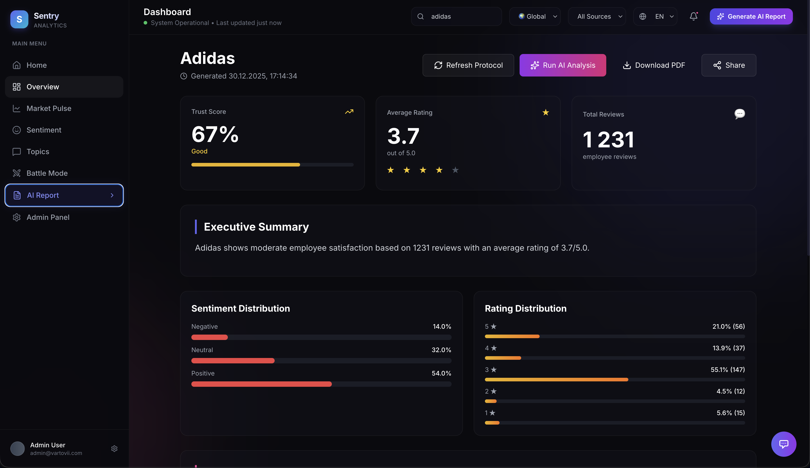
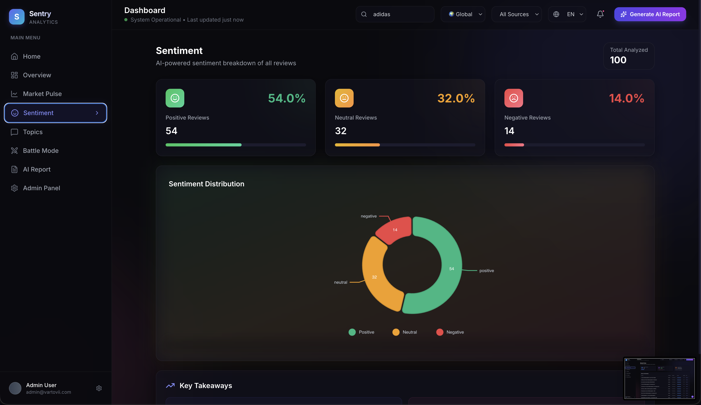
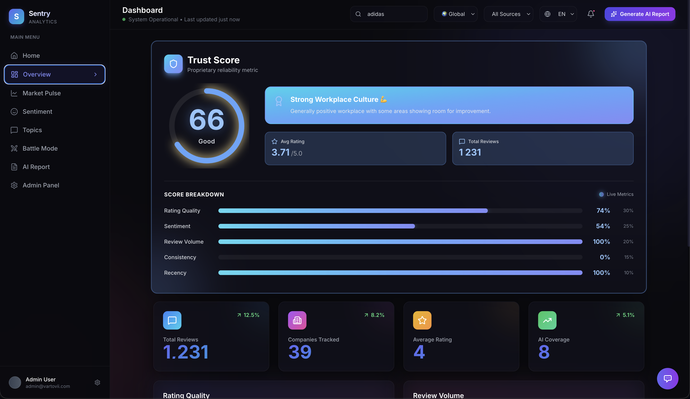

# 🛡️ Vartovii

**AI-Powered Trust Intelligence Platform**

> Enterprise-grade risk assessment for Web3 projects and corporate intelligence. Powered by Google Gemini 2.5 AI.

---

## 🎯 Platform Overview

Vartovii provides institutional-grade intelligence across two verticals:

| Module | Use Case | Trust Score |
|--------|----------|-------------|
| **Crypto Intelligence** | Web3 due diligence for funds & VCs | 5-pillar algorithm (Treasury, Dev, Financials, Tokenomics, Community) |
| **Corporate Analytics** | Employer reputation for recruiters & hedge funds | Multi-source sentiment analysis |

### 🏆 Why Sentry?

- **8 Data Harvesters** — Real-time data from CoinGecko, DefiLlama, GitHub, and more
- **Gemini 2.5 AI** — Advanced reasoning for nuanced risk assessment
- **Battle Mode** — Head-to-head project comparison
- **Institutional UX** — Bloomberg Terminal-inspired dark interface

---

## 🖥️ Demo

### Crypto Intelligence Dashboard

### Crypto Battle Mode

### Corporate Intelligence (Corporate Module)
**AI-Generated Executive Reports**

**Sentiment Analysis**

**Corporate Trust Score**

> 📹 **[Watch Full Demo Video](https://sentryanalytic.com/demo)**

---

## 📊 Platform Stats (January 2026)

| Metric | Value |
|--------|-------|
| Crypto projects tracked | **6,700+** |
| Funding rounds indexed | **6,723** |
| Investors in database | **9,311** |
| Companies analyzed | **500+** |
| AI models active | **3** (Gemini 2.5 Flash/Pro, RAG) |

---

## 🔒 For Investors

### Competitive Advantages

1. **Unique Data Pipeline** — Proprietary 8-stage harvesting pipeline not available elsewhere
2. **5-Pillar Trust Score** — Quantitative scoring algorithm for Web3 projects
3. **VC Tier Classification** — Official tier ratings for 50+ venture capital firms
4. **Multi-Language AI** — English, Ukrainian, German out of the box

### Business Model

- **B2B SaaS** — Monthly subscriptions for VC funds, hedge funds, recruiters
- **API Access** — Enterprise API for programmatic access
- **White-label** — Custom deployments for institutional clients

### Roadmap Highlights

- [x] Crypto Module 2.0 with vesting tracking
- [x] DefiLlama Raises integration (6,700+ projects)
- [x] Battle Mode for project comparison
- [ ] LunarCrush social sentiment integration
- [ ] Whale wallet tracking (DeBank API)
- [ ] Mobile app (React Native)

---

## 🛠️ Technology Stack

| Layer | Technologies |
|-------|-------------|
| **AI** | Google Gemini 2.5 Flash/Pro, Vertex AI RAG |
| **Backend** | FastAPI, Python 3.11, PostgreSQL 14 |
| **Frontend** | React 18, Vite, Tailwind CSS, Framer Motion |
| **Infrastructure** | Google Cloud Run, Cloud SQL, Redis |
| **Search** | Algolia DocSearch |

---

## 🌐 Live Sites

| URL | Purpose |
|-----|---------|
| [sentryanalytic.com](https://sentryanalytic.com) | Main Platform |
| [docs.sentryanalytic.com](https://docs.sentryanalytic.com) | Technical Docs |
| [changelog.sentryanalytic.com](https://changelog.sentryanalytic.com) | Product Updates |

---

## 📚 Documentation

Access our full documentation at [docs.sentryanalytic.com](https://docs.sentryanalytic.com):

- [Crypto Trust Score Formula](https://docs.sentryanalytic.com/docs/crypto/trust-score)
- [Data Sources & APIs](https://docs.sentryanalytic.com/docs/data-sources)
- [API Reference](https://docs.sentryanalytic.com/docs/api/endpoints)

---

## 📞 Contact

**For investment inquiries or partnership discussions:**

- **Email:** invest@sentryanalytic.com
- **Founder:** Vitalii Radionov

---

## 🇺🇦 Made in Ukraine

Built by a Ukrainian founder in Switzerland, combining European quality with innovative AI.

---

**🛡️ Vartovii — Trust Intelligence for the Web3 Era**
