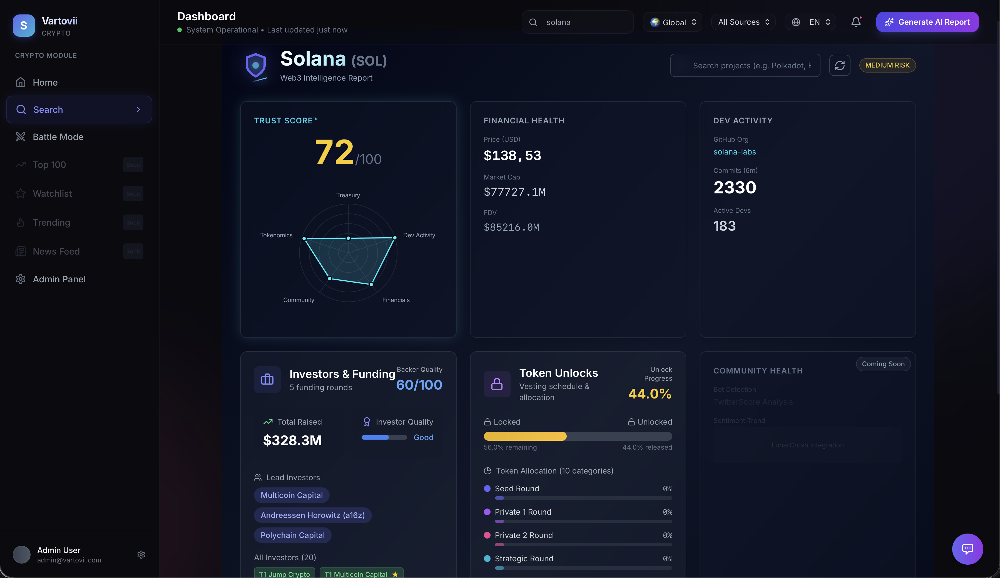
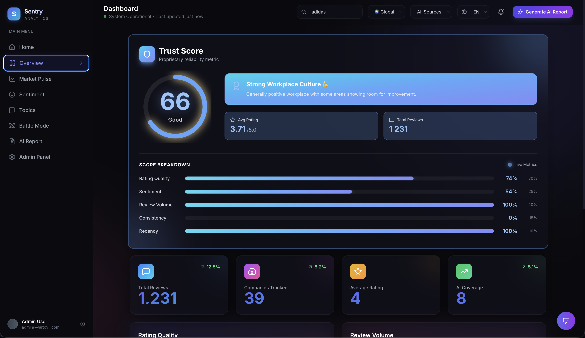
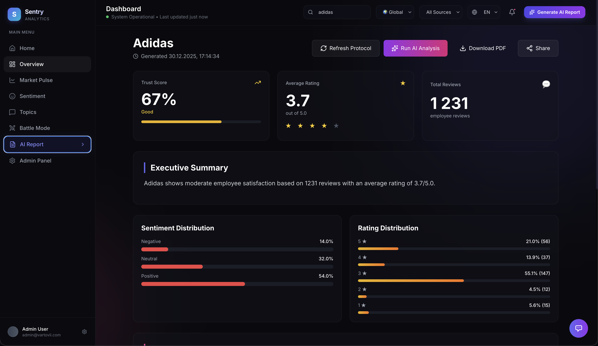

# Vartovii

Machine-verifiable trust decisions for Web3 risk and corporate due diligence.

Vartovii turns fragmented public signals into verifiable trust outputs for
analysts, operators, and autonomous systems. We help teams evaluate tokens,
contracts, wallets, employers, and public reputation workflows using transparent
scoring, source attribution, and production-ready delivery surfaces.

## What This Repository Is

This repository is the public-facing surface for Vartovii.

It contains:

- public product positioning
- architecture summaries
- roadmap snapshots
- live links to the platform, docs, and changelog
- security and contribution guidance

It does **not** contain the private core execution engine, protected data
pipelines, deployment credentials, or internal scoring infrastructure.

## Product Overview

Vartovii operates one trust engine across two immediate markets.

### Web3 Intelligence

Used for token, wallet, contract, and market-integrity assessment.

Representative workflows:

- tokenomics and supply-structure analysis
- smart-contract and protocol-risk review
- wallet-behavior and treasury signal inspection
- market anomaly and manipulation signal detection

### Corporate Intelligence

Used for employer reputation and public-signal due diligence.

Representative workflows:

- employer reputation scoring
- hiring-authenticity and vacancy review
- compliance and public-risk signal monitoring
- source-attributed due diligence summaries

## Product Surfaces

### Web3 Workflow

Real product surface for crypto intelligence, trust scoring, and
source-attributed assessment.

### Corporate Workflow

Real product surface for employer reputation review, public-signal due
diligence, and trust breakdowns.

### Research Output

Representative report-style delivery surface for decision support and evidence
review.

## How The Trust Engine Works

1. **Ingest**
   - Collect public and operational signals from market, GitHub, OSINT, and
     reputation sources.
2. **Validate**
   - Cross-check evidence across specialized workflows instead of relying on a
     single model pass.
3. **Verify**
   - Produce deterministic trust scores, source-attributed findings, and
     API-ready decisions.
4. **Deliver**
   - Expose outputs through dashboards, research reports, and integration
     surfaces.

## Why It Exists

AI can accelerate decisions, but it does not solve trust by default.

Vartovii is built to address three recurring failures in high-stakes workflows:

- fragmented and noisy public data
- weak verification before decisions are made
- outputs that are readable by humans but not usable by systems

## Public And Private Boundary

| Public in this repository       | Private in the core product               |
| ------------------------------- | ----------------------------------------- |
| product overview                | core backend implementation               |
| architecture summaries          | internal scrapers and protected pipelines |
| public docs and changelog links | protected scoring infrastructure          |
| roadmap snapshots               | deployment configuration and secrets      |
| issue tracking and contact info | internal operations and admin surfaces    |

## Current Live Surfaces

| Surface       | URL                                                                  | Purpose                                 |
| ------------- | -------------------------------------------------------------------- | --------------------------------------- |
| Main platform | [sentryanalytic.com](https://sentryanalytic.com)                     | Live Vartovii application               |
| Documentation | [docs.sentryanalytic.com](https://docs.sentryanalytic.com)           | User-facing and technical documentation |
| Changelog     | [changelog.sentryanalytic.com](https://changelog.sentryanalytic.com) | Product and release updates             |
| X             | [x.com/vartovii](https://x.com/vartovii)                             | Public product presence                 |

Note: brand migration from SentryAnalytic to Vartovii is in progress across
public surfaces.

## Operational Posture

Public-facing product surfaces are operated with:

- authenticated admin and internal routes
- rate limiting on expensive operations
- cost controls for high-variance data workloads
- sanitized external error handling
- hardened database and cache access patterns

## Repository Guide

- [`docs/README.md`](docs/README.md) - public documentation index
- [`docs/ARCHITECTURE.md`](docs/ARCHITECTURE.md) - high-level architecture
  summary
- [`docs/FAQ.md`](docs/FAQ.md) - public-repository scope and common questions
- [`docs/INTEGRATION.md`](docs/INTEGRATION.md) - representative integration and
  response examples
- [`docs/ROADMAP.md`](docs/ROADMAP.md) - current public roadmap snapshot
- [`SECURITY.md`](SECURITY.md) - vulnerability reporting policy
- [`CONTRIBUTING.md`](CONTRIBUTING.md) - how to contribute to this public
  surface

## Contact

- Product: [sentryanalytic.com](https://sentryanalytic.com)
- Docs: [docs.sentryanalytic.com](https://docs.sentryanalytic.com)
- Changelog:
  [changelog.sentryanalytic.com](https://changelog.sentryanalytic.com)
- X: [x.com/vartovii](https://x.com/vartovii)
- Security: `sentry@sentryanalytic.com`
- Partnerships: `sentry@sentryanalytic.com`

## Disclaimer

Vartovii provides trust signals and decision-support outputs based on available
data. It is not legal, investment, compliance, or employment advice.
